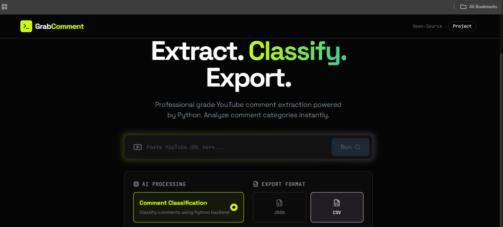

# Grab YT Comments

This helps you read YouTube comments without drowning in the noise.
It extracts comments from any video URL and classifies them locally with **LFM2.5-350M**, giving you a clear dashboard of what people are asking, praising, criticizing, joking about, or pushing back on.



## Project Structure

```text
grab-yt-comments/
|-- backend/
|   |-- api.py              # FastAPI API for the React frontend
|   |-- app.py              # Existing Gradio UI entrypoint
|   |-- scraper.py          # YouTube Data API comment scraping
|   |-- classifier.py       # LLM classification and SQLite persistence
|   |-- pyproject.toml      # Backend dependencies for uv
|   |-- requirements.txt    # Backend dependencies for pip-style deploys
|   |-- uv.lock
|   `-- .gitignore
|-- frontend/
|   |-- App.tsx
|   |-- services/
|   |-- components/
|   |-- package.json
|   `-- .gitignore
|-- .gitignore
|-- LICENSE
`-- README.md
```

## Prerequisite:

<details>
<summary><strong>Local LLM must be running</strong></summary>

Classification depends on a local OpenAI-compatible LLM server. Before running this project, install and start **LFM2.5-350M** with `llama.cpp`.

1. Install `llama.cpp`:

```bash
winget install llama.cpp
```

2. Start the model server:

```bash
llama-server -hf LiquidAI/LFM2.5-350M-GGUF:Q4_K_M
```

Once started, the server is available at `http://localhost:8080`.

</details> ```

## Backend Setup

From the repo root:

```bash
cd backend
uv sync
```

Create `backend/.env`:

```text
YOUTUBE_API_KEY=your_youtube_api_key_here
```

Local LLM settings:

```text
LOCAL_LLM_URL=http://127.0.0.1:8080/v1/chat/completions
LOCAL_LLM_MODEL=LiquidAI/LFM2.5-350M-GGUF:Q4_K_M
CLASSIFICATION_REQUEST_TIMEOUT=30
```

## Run The App

Start the FastAPI backend:

```bash
cd backend
uv run python -m uvicorn api:app --host 127.0.0.1 --port 8000 --reload
```

In a second terminal, start the React frontend:

```bash
cd frontend
npm install
npm run dev
```

Open the frontend:

```text
http://127.0.0.1:3000
```

The frontend calls the backend at:

```text
http://localhost:8000/api/v1/comments
```

You can override that by setting `VITE_API_URL` in `frontend/.env`.

## Existing Gradio App

The original Gradio workflow is still available:

```bash
cd backend
uv run python app.py
```

## Classification Labels

When classification is enabled, comments are classified with the local OpenAI-compatible LLM endpoint into:

- `appreciation`
- `humor`
- `questions`
- `criticism`
- `personal experience`
- `feedback`
- `spam`

The backend stores scraped comments first, classifies each saved comment, writes labels back to SQLite, and returns the final result from the database.
